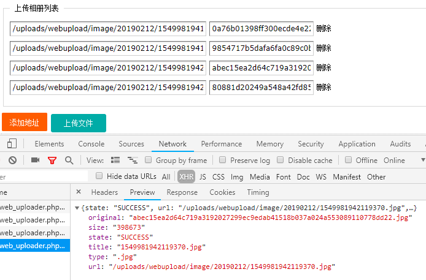

## 目录

* webuploader上传功能


### 一、webuploader上传

> * 后台文件
>
>   * `include/webuploader/Uploader.class.php`
>   * `include/webuploader/Uploadfile.class.php`
>   * `dede/web_uploader.php`，自定义常量及参数
>
> * 前端：
>
>   ```html
>   <script src="js/plugins/jquery/1.12.4/jquery.min.js"></script>
>   <!-- upload -->
>   <script type="text/javascript" src="/include/ueditor/third-party/webuploader/webuploader.min.js"></script>
>   <!-- upload end -->
>   
>   
>   <fieldset class="blue pad-10">
>       <legend>上传相册列表</legend>
>       <div class="picList" id="list_photo_files"><ul id="photo-sort-items"></ul>
>   </fieldset>
>   <div class="bk10"></div>
>   <input type="button" class="custom_button custom_button_orgin" value="添加地址" name="delete" onClick="add_null_file('photo')" >
>   <span id="filePicker_photo">上传文件</span>
>   
>       
>   <script>
>   var uploader = WebUploader.create({
>       auto: true,
>       fileVal:'upfile',
>       duplicate :true,
>       multiple: false,
>       fileSingleSizeLimit:2048*1024,
>       server: 'web_uploader.php?c=uploadfile&a=ueditor&action=uploadfile',
>       pick: '#filePicker_photo',
>       accept: {
>           title: 'Images',
>           extensions: 'gif,png,jpg'
>       }
>   });
>   uploader.on( 'uploadSuccess', function( file, ret) {
>       htmlList('photo',ret.url,file,'');
>   });
>   uploader.on( 'error', function( file) {
>       if (file == 'Q_TYPE_DENIED') {
>           alert('请上传gif,png,jpg格式文件');
>       } else if (file == 'F_EXCEED_SIZE') {
>           alert('文件大小不能超过 2 M,请压缩');
>       }else {
>           alert('上传出错！请检查后重新上传！错误代码'+file);
>       }
>   });
>   </script>
>   ```
>

* 前端： `/dede/templets/org_add.htm`
* URL：`web_uploader.php?c=uploadfile&a=ueditor&action=uploadfile`



